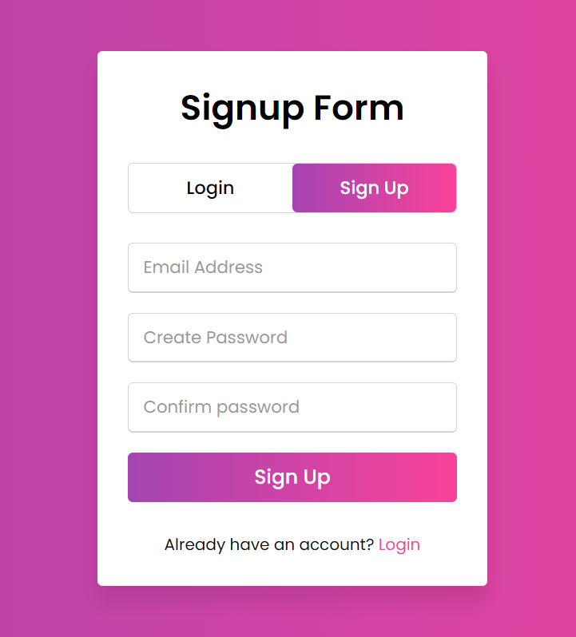
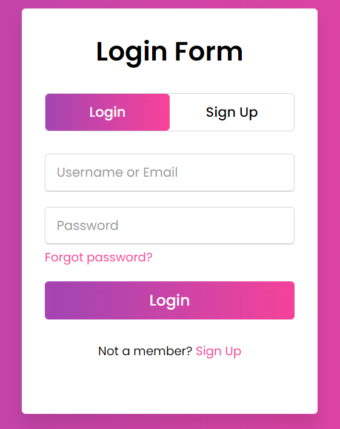

# Login and Signup Form using HTML, CSS, and JavaScript

Welcome to the **Login-and-Signup-form-using-HTML-CSS-JS** repository! 🚀

This project delivers a visually appealing and fully functional authentication interface with both Login and Signup forms, built using only HTML, CSS, and JavaScript. Perfect for beginners looking to understand the basics of front-end form handling and UI design, as well as developers seeking a sleek template for their web apps.

---

## ✨ Features

- **Modern UI Design**: Stylish and clean interface with smooth transitions between forms.
- **Responsive Layout**: Optimized for desktop and mobile screens.
- **Form Validation**: Real-time input validation using JavaScript for a seamless user experience.
- **Password Visibility Toggle**: Show/hide password feature for better usability.
- **Easy Customization**: Well-structured code for quick design and logic tweaks.

---

## 📂 Project Structure

```
/Login-and-Signup-form-using-HTML-CSS-JS
│
├── index.html        # Main HTML file containing both forms
├── style.css         # CSS for layout, colors, and responsiveness
├── script.js         # JavaScript for form switching and validation
└── README.md         # Project documentation (this file)
```

---

## 🚀 Getting Started

1. **Clone the Repository**
   ```bash
   git clone https://github.com/GAURAV-InnovativeCodeZone/Login-and-Signup-form-using-HTML-CSS-JS.git
   ```

2. **Open in Browser**
   - Open `index.html` directly in your web browser.

---

## 🛠️ Customization

- **Colors & Fonts**: Change them in `style.css` to match your brand.
- **Form Logic**: Update `script.js` to connect with your backend or add new features.
- **Add Fields**: Easily extend forms with more input fields as needed.

---

## 📸 Screenshots

### Signup Form



### Login Form



---

## 🤝 Contributing

Contributions are welcome! Feel free to fork the repo and submit pull requests.

---

## 📜 License

This project is open-source. Use it freely in your projects!

---

## 💡 Inspiration

Built as a learning project and template for modern web authentication UIs.

---

**Made with ❤️ by [GAURAV-InnovativeCodeZone](https://github.com/GAURAV-InnovativeCodeZone)**
